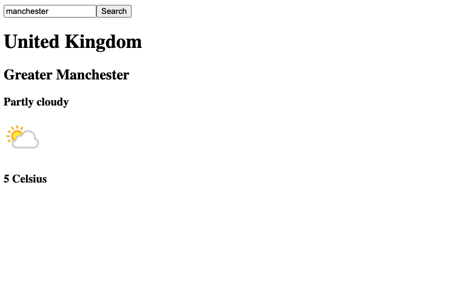

 </a> <a href="https://sass-lang.com" target="_blank">
<h2><a href="https://a1danw.github.io/react-fetching_with_promises/" target="_blank">Fetching data via useEffect and promises - no redux.</a></h2>

